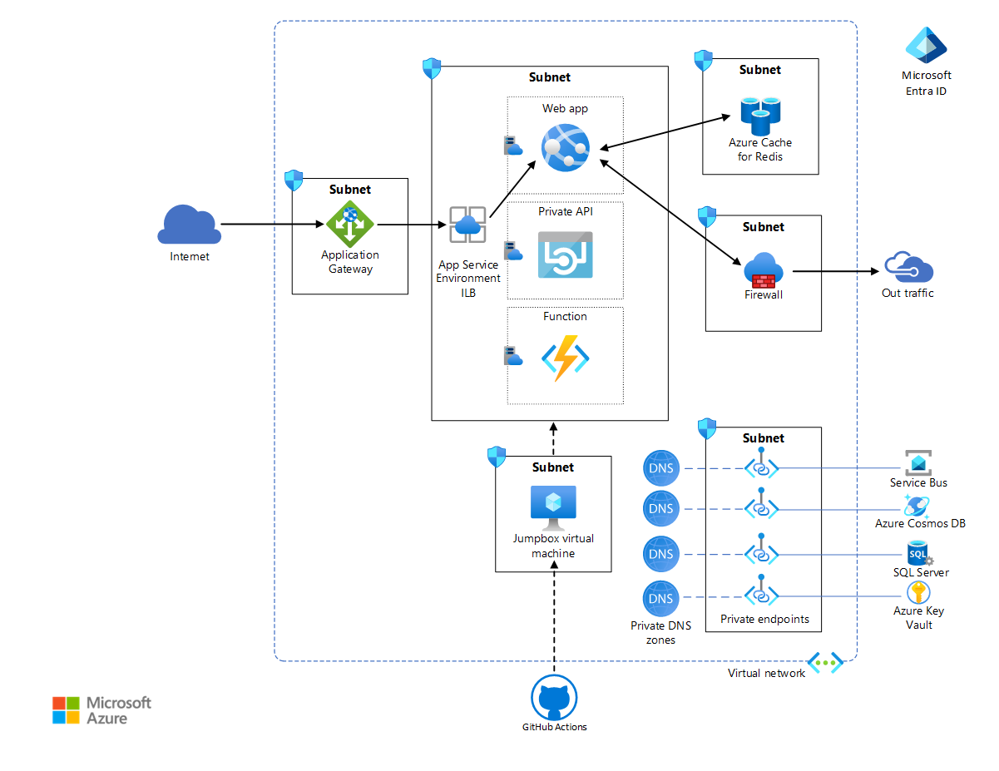
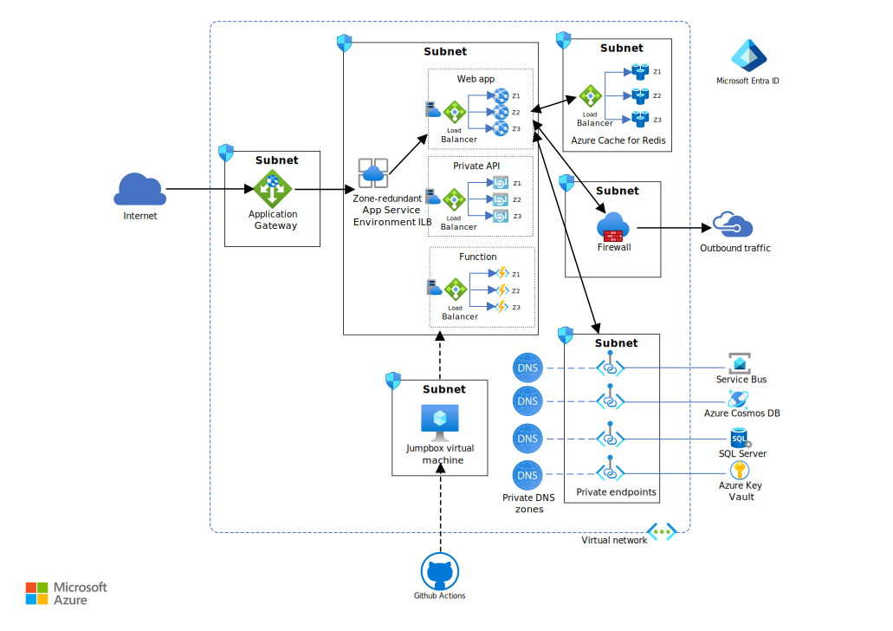
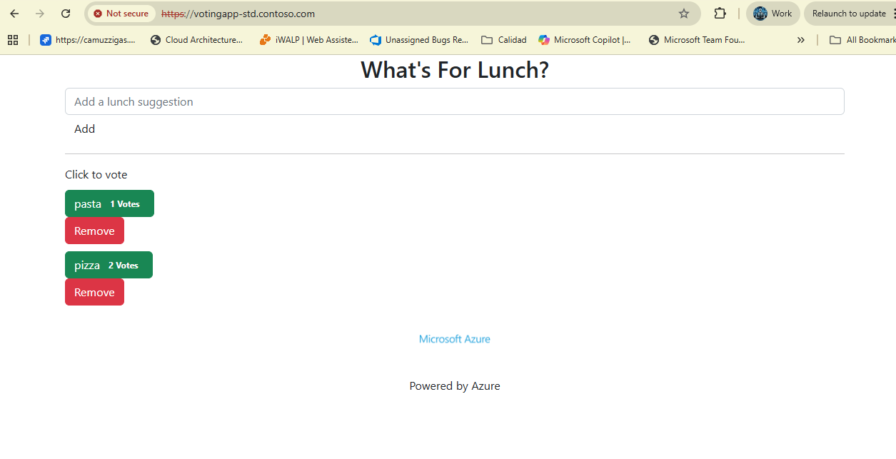

# App Service Environment Deployment

This reference implementation works on App Service Environment production deployments. The starting point is a standard deployment. For more information about this scenario, see the reference architecture: [Enterprise deployment using Azure App Service Environment](https://learn.microsoft.com/azure/architecture/web-apps/app-service-environment/architectures/ase-standard-deployment)



And there is a High Availability (HA) architecture that shows how to improve the resiliency of an ASE deployment by deploying in multiple availability zones. For more information about this scenario, see the reference architecture: [High availability enterprise deployment that uses App Service Environment](https://learn.microsoft.com/azure/architecture/web-apps/app-service-environment/architectures/app-service-environment-high-availability-deployment)



You will walk through the deployment in a detailed manner to help you understand each component of this architecture. This guidance is meant to teach about each layer and provide you with the knowledge necessary to apply it to your workload. We recommend starting with the standard option and then move to the HA path.

### Core architecture components

#### Azure platform

The following services are key to locking down the App Service Environment in this architecture:

* __App Service Environment__ is an Azure App Service feature that provides a fully isolated and dedicated environment to run App Service apps securely at high scale. Unlike the App Service public multitenant offering that shares supporting infrastructure, an App Service Environment provides dedicated compute for a single customer.

* __Azure Virtual Network__ is a private Azure cloud network that's owned by an enterprise. It provides enhanced network-based security and isolation. App Service Environment is an App Service deployment into a subnet of the enterprise-owned virtual network. It allows the enterprise to tightly control that network space and the resources it accesses by using network security groups and private endpoints.

* __Application Gateway__ is an application-level web traffic load balancer with TLS/SSL offloading and WAF. It listens on a public IP address and routes traffic to the application endpoint in the ILB App Service Environment. Since this is application-level routing, it can route traffic to multiple apps within the same ILB App Service Environment. For more information, see Application Gateway multiple site hosting.

* __Azure Firewall__ is used to restrict the outbound traffic from the web application. Outgoing traffic that doesn't go through the private endpoint channels and a route table required by App Service Environment is directed to the firewall subnet. For the sake of simplicity, this architecture configures all private endpoints on the services subnet.

* __Microsoft Entra ID__ provides access rights and permissions management to Azure resources and services. Managed Identities assigns identities to services and apps, automatically managed by Microsoft Entra ID. These identities can be used to authenticate to any service that supports Microsoft Entra authentication. This removes the need to explicitly configure credentials for these apps. This architecture assigns a managed identity to the web app.

* __Azure Key Vault__ stores any secrets and credentials required by the apps. Use this option over storing secrets directly in the application.

* __GitHub Actions__ provides continuous integration and continuous deployment capabilities in this architecture. Because the App Service Environment is in the virtual network, a virtual machine is used as a jumpbox inside the virtual network to deploy apps in the App Service plans. The action uses a self-hosted agent inside the jumpbox to build and deploy.

## Deploy the reference implementation

This reference architecture deploys an enterprise web application in an internal App Service Environment, also called an ILB App Service Environment. 

App Service Environment must always be deployed in its own subnet in the enterprise virtual network to allow tight control of the incoming and outgoing traffic. Within this subnet, App Service applications are deployed in one or more App Service plans, which is a collection of physical resources required to run the app. Depending on the complexity and resource requirement, an App Service plan can be shared between multiple apps. This reference implementation deploys a web app named Voting App, which interacts with a private web API and a function. It also deploys a dummy web app named Test App to demonstrate multi-app deployments. Each App Service app is hosted in its own App Service plan, allowing each to be scaled independently if necessary. All resources required by these hosted apps, such as storage and compute, as well as scaling needs are fully managed by the App Service Environment infrastructure.

### 1. :rocket: Preparing

 1. Prerequisites

- [azure-cli](https://docs.microsoft.com/cli/azure/install-azure-cli?view=azure-cli-latest) 2.75.0 or newer.

* **jq** tool installed for your platform:
  `sudo apt-get install jq`

1. An Azure subscription.

   The subscription used in this deployment cannot be a [free account](https://azure.microsoft.com/free); it must be a standard EA, pay-as-you-go, or Visual Studio benefit subscription. This is because the resources deployed here are beyond the quotas of free subscriptions.

1. Login into the Azure subscription that you'll be deploying into.

   ```bash
   az login
   export TENANTID_AZSUBSCRIPTION=$(az account show --query tenantId -o tsv)
   echo TENANTID_AZSUBSCRIPTION: $TENANTID_AZSUBSCRIPTION
   TENANTS=$(az rest --method get --url https://management.azure.com/tenants?api-version=2020-01-01 --query 'value[].{TenantId:tenantId,Name:displayName}' -o table)
   ```

1. Validate your saved Azure subscription's tenant id is correct

   ```bash
   echo "${TENANTS}" | grep -z ${TENANTID_AZSUBSCRIPTION}
   ```

   :warning: Do not proceed if the tenant highlighted in red is not correct. Start over by `az login` into the proper Azure subscription.

1. The user or service principal initiating the deployment process _must_ have the following minimal set of Azure Role-Based Access Control (RBAC) roles:

   * [Contributor role](https://learn.microsoft.com/azure/role-based-access-control/built-in-roles#contributor) is _required_ at the subscription level to have the ability to create resource groups and perform deployments.
   * [User Access Administrator role](https://learn.microsoft.com/azure/role-based-access-control/built-in-roles#user-access-administrator) is _required_ at the subscription level since you'll be performing role assignments.

1. Fork this repository, then clone or download it locally.

   The fork will enable you to execute GitHub Actions.

   ```bash
   git clone https://github.com/<OWNER>/app-service-environments-ILB-deployments.git
   cd app-service-environments-ILB-deployments/deployment
   ```
   
1. Set a variable for the App URL that will be used in the rest of this deployment.

   ```bash
   export APPGW_APP1_URL=votingapp.contoso.com
   export APPGW_APP2_URL=testapp.contoso.com
   ```
1. Run the following commands after providing values for the variables.

   ```bash
   export SQLADMINUSER=user-admin
   export SQLADMINPASSWORD=
   export JUMPBOX_USER=user-admin
   export JUMPBOX_PASSWORD=
   export PFX_PASSWORD=
   export ADMIN_USER_ID=$(az ad signed-in-user show --query id -o tsv)
   export SUBID=$(az account show --query id -o tsv)
   ```   
    **Note:** For SQL Server administrator password requirements, check [Password Policy](https://docs.microsoft.com/en-us/sql/relational-databases/security/password-policy?view=sql-server-2017).

1. Generate a client-facing, self-signed TLS certificate

   ```bash
    openssl req -x509 -nodes -days 365 -newkey rsa:2048 -subj "/CN=${APPGW_APP1_URL}" -out appgw_1.crt -keyout appgw_1.key

    openssl pkcs12 -export -out appgw_1.pfx -in appgw_1.crt -inkey appgw_1.key -passout pass:$PFX_PASSWORD
     # No matter if you used a certificate from your organization or you generated one from above, you'll need the certificate (as `.pfx`) to be Base64
    export CERT_DATA_1=$(cat appgw_1.pfx | base64 | tr -d '\n' | tr -d '\r')

    openssl req -x509 -nodes -days 365 -newkey rsa:2048 -subj "/CN=${APPGW_APP2_URL}" -out appgw_2.crt -keyout appgw_2.key

    openssl pkcs12 -export -out appgw_2.pfx -in appgw_2.crt -inkey appgw_2.key -passout pass:$PFX_PASSWORD
     # No matter if you used a certificate from your organization or you generated one from above, you'll need the certificate (as `.pfx`) to be Base64
    export CERT_DATA_2=$(cat appgw_2.pfx | base64 | tr -d '\n' | tr -d '\r')
   ```

  > :book: As this is going to be a user-facing site, they purchase an EV cert from their CA. This will be served in front of the Azure Application Gateway.

   :warning: Do not use the certificate created by this script for your solutions. Self-signed certificates are used here for illustration purposes only. For your compute infrastructure, use your organization's requirements for procurement and lifetime management of TLS certificates, _even for development purposes_.

   Create the certificate that will be presented to web clients by Azure Application Gateway.

### 2. Create the resource group

   The resource group created will contain all the resources included in the current reference implementation.

   ```bash
   # [This takes less than one minute to run.]
   az group create -n rg-app-service-environments-centralus -l centralus
   ```

### 3. Deploy global network related resources

   This module sets up the foundational networking infrastructure required for deploying an App Service Environment (ASE) in Azure. It begins by provisioning a dedicated virtual network (VNet) with a defined IP address space to ensure isolation and control over traffic flow. 

   ```bash
   # [This takes less than one minute to run.]
   az deployment group create -g rg-app-service-environments-centralus --template-file templates/network.bicep

   export VNET_NAME=$(az deployment group show -g rg-app-service-environments-centralus -n network --query properties.outputs.vnetName.value -o tsv)
   echo $VNET_NAME
   export VNET_ROUTE_NAME=$(az deployment group show -g rg-app-service-environments-centralus -n network --query properties.outputs.vnetRouteName.value -o tsv)
   echo $VNET_ROUTE_NAME
   ```

### 4. Application Service Environment (ASE)
   This module provisions the core components required to deploy an App Service Environment v3 (ASEv3) within a secure and isolated subnet. It begins by defining a network security group to control inbound traffic, allowing only web traffic from an application gateway and denying all other access. A dedicated subnet is then created within the specified virtual network, configured with routing, security, and delegation to support ASE deployment. Finally, the ASEv3 instance is deployed with customizable parameters for host count and zone redundancy, enabling scalable and resilient hosting of web applications.

   ```bash
   # [This takes about ten minutes to run.]
   # For HA change zoneRedundant to true
   az deployment group create -g rg-app-service-environments-centralus  --template-file templates/ase.bicep -n ase --parameters vnetName=$VNET_NAME vnetRouteName=$VNET_ROUTE_NAME zoneRedundant=false

   export ASE_DNS_SUFFIX=$(az deployment group show -g rg-app-service-environments-centralus  -n ase --query properties.outputs.dnsSuffix.value -o tsv)
   echo $ASE_DNS_SUFFIX
   export ASE_SUBNET_NAME=$(az deployment group show -g rg-app-service-environments-centralus  -n ase --query properties.outputs.aseSubnetName.value -o tsv)
   echo $ASE_SUBNET_NAME
   export ASE_NAME=$(az deployment group show -g rg-app-service-environments-centralus  -n ase --query properties.outputs.aseName.value -o tsv)
   echo $ASE_NAME
   export ASE_ID=$(az deployment group show -g rg-app-service-environments-centralus  -n ase --query properties.outputs.aseId.value -o tsv)
   echo $ASE_ID
   export ASE_ILB_IP_ADDRESS=$(az resource show -g rg-app-service-environments-centralus  --name $ASE_NAME --resource-type "Microsoft.Web/hostingEnvironments" | jq -r '.properties.networkingConfiguration.internalInboundIpAddresses[]')
   echo $ASE_ILB_IP_ADDRESS
   ```

### 5. Deploy Firewall
   This module provisions an Azure Firewall to enhance the security posture of the App Service Environment deployment. A static public IP address is allocated to the firewall, enabling external connectivity. This setup ensures that the ASE operates within a secure, monitored, and well-governed network boundary.

   ```bash
   # [This takes about ten minutes to run.]
   az deployment group create -g rg-app-service-environments-centralus --template-file templates/firewall.bicep --parameters vnetName=$VNET_NAME
   ```

### 6. Deploy the private DNS
   This module configures private DNS resolution for the internal load balancer (ILB) of the App Service Environment. These records ensure that internal applications and deployment endpoints are resolvable within the virtual network. The DNS zone is linked to the ASE's VNet, enabling seamless name resolution for services hosted in the environment.

   ```bash
   # [This takes about two minutes to run.]
   az deployment group create -g rg-app-service-environments-centralus --template-file templates/dns.bicep -n dns --parameters vnetName=$VNET_NAME zoneName=$ASE_DNS_SUFFIX ipAddress=$ASE_ILB_IP_ADDRESS
   ```

### 7. Deploy Jumpbox
   This module provisions a Jumpbox virtual machine to facilitate secure administrative access to resources within the virtual network, including the App Service Environment.  
   Later on, the Jumpbox will host a GitHub self-hosted runner. This allows you to run your own runners and customize the environment used for executing jobs in your GitHub Actions workflows.

   ```bash
   # [This takes about two minutes to run.]
    az deployment group create -g rg-app-service-environments-centralus --template-file templates/jumpbox.bicep --parameters vnetName=$VNET_NAME adminUsername=$JUMPBOX_USER adminPassword=$JUMPBOX_PASSWORD

    export JUMPBOX_PUBLIC_IP=$(az deployment group show -g rg-app-service-environments-centralus -n jumpbox --query properties.outputs.jumpboxPublicIpAddress.value -o tsv)
    echo $JUMPBOX_PUBLIC_IP

    export JUMPBOX_SUBNET_NAME=$(az deployment group show -g rg-app-service-environments-centralus -n jumpbox --query properties.outputs.jumpboxSubnetName.value -o tsv)
    echo $JUMPBOX_SUBNET_NAME
   ```

### 8. Deploy services: cosmos, sql, servicebus and storage
   This module provisions the essential backend services required for the application. It includes a Cosmos DB instance for distributed caching, a secure SQL Server and database for relational data, and an Azure Key Vault for managing secrets using role-based access control. A premium-tier Service Bus is configured to enable reliable messaging between application components. Additionally, a storage account with a blob container provides scalable storage for static resources, while a second storage account is designated for use by the Function App as Azure WebJob storage. All services are deployed with public network access disabled where applicable, ensuring a secure and private infrastructure.

   ```bash
   # [This takes about five minutes to run.]
   # For HA change zoneRedundant to true
    az deployment group create -g rg-app-service-environments-centralus --template-file templates/services.bicep \
        --parameters sqlAdminUserName=$SQLADMINUSER sqlAdminPassword=$SQLADMINPASSWORD sqlEntraIdAdminSid=$ADMIN_USER_ID  zoneRedundant=false

            
    export COSMOSDB_NAME=$(az deployment group show -g rg-app-service-environments-centralus -n services --query properties.outputs.cosmosDbName.value -o tsv)
    echo $COSMOSDB_NAME
    export SQL_SERVER=$(az deployment group show -g rg-app-service-environments-centralus -n services --query properties.outputs.sqlServerName.value -o tsv)
    echo $SQL_SERVER
    export SQL_DATABASE=$(az deployment group show -g rg-app-service-environments-centralus -n services --query properties.outputs.sqlDatabaseName.value -o tsv)
    echo $SQL_DATABASE
    export KEYVAULT_NAME=$(az deployment group show -g rg-app-service-environments-centralus -n services --query properties.outputs.keyVaultName.value -o tsv)
    echo $KEYVAULT_NAME
    export RESOURCES_STORAGE_ACCOUNT=$(az deployment group show -g rg-app-service-environments-centralus -n services --query properties.outputs.resourcesStorageAccountName.value -o tsv)
    echo $RESOURCES_STORAGE_ACCOUNT
    export RESOURCES_STORAGE_ACCOUNT_FUNCTION_APP=$(az deployment group show -g rg-app-service-environments-centralus -n services --query properties.outputs.resourcesStorageAccountFunctionAppName.value -o tsv)
    echo $RESOURCES_STORAGE_ACCOUNT_FUNCTION_APP
    export RESOURCES_CONTAINER_NAME=$(az deployment group show -g rg-app-service-environments-centralus -n services --query properties.outputs.resourcesContainerName.value -o tsv)
    echo $RESOURCES_CONTAINER_NAME
    export SERVICEBUS_NAMESPACE_NAME=$(az deployment group show -g rg-app-service-environments-centralus -n services --query properties.outputs.serviceBusName.value -o tsv)
    echo $SERVICEBUS_NAMESPACE_NAME
   ```

### 9. Uploads image to the storage account
    Upload images to be used on the web page. These images are static web resources.

   ```bash
   # [This takes less than one minute to run.]
    az storage blob upload -c $RESOURCES_CONTAINER_NAME -f Microsoft_Azure_logo_small.png -n Microsoft_Azure_logo_small.png --account-name $RESOURCES_STORAGE_ACCOUNT

    export RESOURCE_URL="$(az storage account show -g rg-app-service-environments-centralus -n $RESOURCES_STORAGE_ACCOUNT --query primaryEndpoints.blob -o tsv)$RESOURCES_CONTAINER_NAME/Microsoft_Azure_logo_small.png"
    echo $RESOURCE_URL
   ```

### 10.  Create the app service plans and the sites
   This module orchestrates the deployment of the core application components within the App Service Environment. It provisions four isolated apps—web, API, function, and test—each with dedicated hosting plans and integrated monitoring via Application Insights and Log Analytics. A premium Redis Cache is deployed in a secure subnet with Entra ID authentication and custom network rules. The apps are securely connected to backend services including Cosmos DB, SQL Database, Service Bus, and a Storage Account, using managed identities and role assignments to enforce least-privilege access. This setup ensures a scalable, secure, and observable application landscape, fully integrated within the ASE infrastructure

   ```bash
   # [This takes about thirty minutes to run.]
   # For HA change zoneRedundant to true
    az deployment group create -g rg-app-service-environments-centralus --template-file templates/sites.bicep -n sites --parameters aseName=$ASE_NAME \
    vnetName=$VNET_NAME cosmosDbName=$COSMOSDB_NAME sqlServerName=$SQL_SERVER sqlDatabaseName=$SQL_DATABASE keyVaultName=$KEYVAULT_NAME serviceBusNamespace=$SERVICEBUS_NAMESPACE_NAME  storageAccountName=$RESOURCES_STORAGE_ACCOUNT_FUNCTION_APP \
    aseDnsSuffix=$ASE_DNS_SUFFIX  zoneRedundant=false
	
    export INTERNAL_APP1_URL=$(az deployment group show -g rg-app-service-environments-centralus -n sites --query properties.outputs.votingAppUrl.value -o tsv) && \
    export INTERNAL_APP2_URL=$(az deployment group show -g rg-app-service-environments-centralus -n sites --query properties.outputs.testAppUrl.value -o tsv) && \
    export VOTING_WEB_APP_PRINCIPAL_ID=$(az deployment group show -g rg-app-service-environments-centralus -n sites --query properties.outputs.votingWebAppIdentityPrincipalId.value -o tsv) && \
    export VOTING_COUNTER_FUNCTION_NAME=$(az deployment group show -g rg-app-service-environments-centralus -n sites --query properties.outputs.votingFunctionName.value -o tsv) && \
    export VOTING_COUNTER_FUNCTION_PRINCIPAL_ID=$(az deployment group show -g rg-app-service-environments-centralus -n sites --query properties.outputs.votingCounterFunctionIdentityPrincipalId.value -o tsv) && \
    export VOTING_API_NAME=$(az deployment group show -g rg-app-service-environments-centralus -n sites --query properties.outputs.votingApiName.value -o tsv) && \
    export VOTING_API_PRINCIPAL_ID=$(az deployment group show -g rg-app-service-environments-centralus -n sites --query properties.outputs.votingApiIdentityPrincipalId.value -o tsv)

    echo $INTERNAL_APP1_URL
    echo $INTERNAL_APP2_URL
    echo $VOTING_WEB_APP_PRINCIPAL_ID
    echo $VOTING_COUNTER_FUNCTION_NAME
    echo $VOTING_COUNTER_FUNCTION_PRINCIPAL_ID
    echo $VOTING_API_NAME
    echo $VOTING_API_PRINCIPAL_ID
   ```

### 11. Deploy and Configure App Gateway with Multiple Backend Apps and Certificates
   This module provisions an Azure Application Gateway with integrated Web Application Firewall (WAF v2) to securely manage and route external traffic to backend applications hosted in the environment. It sets up a dedicated subnet and network security group, configures a static public IP, and enables autoscaling for performance flexibility. The gateway is dynamically configured to support multiple applications, each with its own backend pool, HTTPS listener, SSL certificate, health probe, and routing rule. This setup ensures secure, scalable, and resilient traffic management with centralized control and monitoring.
   
   ```bash
    # Note: This command will overwrite 'appgwApps.parameters.json' if it already exists.
cat <<EOF > appgwApps.parameters.json
[
  { 
    "name": "votapp", 
    "routingPriority": 100,
    "hostName": "${APPGW_APP1_URL}", 
    "backendAddresses": [ 
      { 
        "fqdn": "${INTERNAL_APP1_URL}" 
      } 
    ], 
    "certificate": { 
      "data": "${CERT_DATA_1}", 
      "password": "${PFX_PASSWORD}" 
    }, 
    "probePath": "/health" 
  },
  { 
    "name": "testapp", 
    "routingPriority": 101,
    "hostName": "${APPGW_APP2_URL}", 
    "backendAddresses": [ 
      { 
        "fqdn": "${INTERNAL_APP2_URL}" 
      } 
    ], 
    "certificate": { 
      "data": "${CERT_DATA_2}", 
      "password": "${PFX_PASSWORD}" 
    }, 
    "probePath": "/"
  }
]
EOF
    
   # [This takes about ten minutes to run.]
   az deployment group create -g rg-app-service-environments-centralus --template-file templates/appgw.bicep --parameters vnetName=$VNET_NAME  appgwApplications=@appgwApps.parameters.json

   export APPGW_PUBLIC_IP=$(az deployment group show -g rg-app-service-environments-centralus -n appgw --query properties.outputs.appGwPublicIpAddress.value -o tsv)
   echo $APPGW_PUBLIC_IP
   ```
### 12. Deploy private endpoints
   This module establishes secure, private connectivity to essential Azure services by provisioning private endpoints within a dedicated subnet. It includes endpoints for SQL Server, Service Bus, Cosmos DB, Storage Account, and Key Vault, each configured with corresponding private DNS zones to enable internal name resolution. The setup ensures that traffic to these services remains within the Azure backbone, eliminating exposure to the public internet. Network security groups and DNS zone groups are used to enforce access control and maintain reliable service discovery, forming a critical part of the secure infrastructure for the App Service Environment

   ```bash
    # [This takes about ten minutes to run.]
    az deployment group create -g rg-app-service-environments-centralus --template-file templates/privateEndpoints.bicep --parameters SubId=$SUBID \
    vnetName=$VNET_NAME cosmosDBName=$COSMOSDB_NAME sqlName=$SQL_SERVER akvName=$KEYVAULT_NAME sbName=$SERVICEBUS_NAMESPACE_NAME storageAccountName=$RESOURCES_STORAGE_ACCOUNT_FUNCTION_APP
   ```

### 13. __Run in PowerShell__ - Add App Gateway certificate to the local machine - must use elevated permissions

   ```PowerShell
    # Replace $PFX_PASSWORD with the value. That variables don't exist in PowerShell.
    
    cd .\app-service-environments-ILB-deployments\deployment\

    certutil -f -p $PFX_PASSWORD -importpfx appgw_1.pfx
    certutil -f -p $PFX_PASSWORD -importpfx appgw_2.pfx
   ```

### 14. Add lines in your Host file to resolve name  

  Open `C:/windows/system32/drivers/etc/hosts` file as administrator. Then, Add the following resulted lines at the end of the file.

   ```bash
     # Run the following commands in your terminal to obtain the IP and hostname values:
     echo $APPGW_PUBLIC_IP $APPGW_APP1_URL
     echo $APPGW_PUBLIC_IP $APPGW_APP2_URL

     # Copy the output and manually add these lines to your hosts file (C:/windows/system32/drivers/etc/hosts) as administrator.
   ```

## Insert Document in Cosmos Db

1. After deployment ends in the last step, run the following commands to get the resourceURL:

```
echo "{\"id\": \"1\", \"Message\": \"Powered by Azure\", \"MessageType\": \"AD\", \"Url\": \"${RESOURCE_URL}\"}"
```

The following snippet shows an example of the JSON response:

```
{"id": "1","Message": "Powered by Azure","MessageType": "AD","Url": "https://webappri.blob.core.windows.net/webappri/Microsoft_Azure_logo_small.png"}
```

2. Open Azure portal, navigate to the resource group of the deployment, and click on **Azure Cosmos Db Account**.

- Select **Network**, there you can see:  
  **Add IP ranges to allow access from the internet or your on-premises networks**. 
  Click on **Add my current ip**, and save it. (It takes time to update the firewall)

- From Cosmos Db Data Explorer, select **cacheContainer**, then click on **Items**. Click on **New Item**.  
  Replace the entire JSON payload with the following example, ensuring the fields `id`, `Message`, `MessageType`, and `Url` are present and formatted as shown below, then click **Save**:

- Go to Azure portal and open the resource group of deployment above. Click on **Azure Cosmos Db Account**, then select **Network**, then delete your public ip.

## Set up Sql Database

### 1. Connect Query Editor
    - Go to Azure Portal
    - Go to the Azure SQL server
    - On the networking, Selected Networks, and then Add Client IPv4. Save.
    - Then Go to the Azure SQL Database
    - Select Query Editor and Log In using Microsoft Entra authentication

### 2. Execute the query
This is the table used by the application

```sql
  IF OBJECT_ID('dbo.Counts', 'U') IS NULL 
      CREATE TABLE Counts(
          ID INT NOT NULL IDENTITY PRIMARY KEY, 
          Candidate VARCHAR(32) NOT NULL, 
          Count INT
      );
```

### 3. Managed Identities as users in the Sql Database

    ```bash
    export VOTING_COUNTER_FUNCTION_NAME=$(az deployment group show -g rg-app-service-environments-centralus -n sites --query properties.outputs.votingFunctionName.value -o tsv)
    export VOTING_API_NAME=$(az deployment group show -g rg-app-service-environments-centralus -n sites --query properties.outputs.votingApiName.value -o tsv)

    export SQL="CREATE USER [$VOTING_COUNTER_FUNCTION_NAME] FROM EXTERNAL PROVIDER;ALTER ROLE db_datareader ADD MEMBER [$VOTING_COUNTER_FUNCTION_NAME];ALTER ROLE db_datawriter ADD MEMBER [$VOTING_COUNTER_FUNCTION_NAME];CREATE USER [$VOTING_API_NAME] FROM EXTERNAL PROVIDER;ALTER ROLE db_datareader ADD MEMBER [$VOTING_API_NAME];ALTER ROLE db_datawriter ADD MEMBER [$VOTING_API_NAME];"

    ```
   
   - Create SQL Server MSI integration

    ```bash
     # Execute Script in Query Editor
     echo $SQL
    ```

## :ship: Publish ASP.NET Core Web, API, and Function Applications

1. [Prepare Jumpbox to Run GitHub Action self-hosted runner](./prepare_jumpbox.md).

2. Set Up Github Actions Variables

* Go to your repository on GitHub.
* Click on Settings.
* In the left sidebar, click Variables under the Secrets and variables section.
* Click Actions.
* Click New variable.
* Set up the following variables
   * FUNCTION_APPPATH - eg. "code/function-app-ri/VoteCounter"
   * BUILDCONFIGURATION - eg. "Release"
   * FUNCTION_APP_NAME - App Service name for Voting Function App
   * VOTINGDATA_APPPATH - eg. "code/web-app-ri/VotingData"
   * VOTINGDATA_WEB_APP_NAME - App Service name for Voting API App
   * VOTINGWEB_APPPATH - eg. "code/web-app-ri/VotingWeb"
   * VOTINGWEB_APP_NAME - App Service name for Voting Web App

3. Run Github Actions to Deploy Web Apps, API, and Function:
  * Go to your GitHub Repository.
  * Click on the "Actions" tab.
  * For each app, run the corresponding workflow from the master branch:
    - For the Voting Web App, run the workflow named `Build and Deploy VotingWeb App`.
    - For the Voting API, run the workflow named `Build and Deploy VotingData App`.
    - For the Function App, run the workflow named `Build and Deploy Function App`.

## :wink: Check Deploy
 At this point you should be able to test the application:  
    Open: https://votingapp.contoso.com  

_NOTE: You may see a certificate validation error in your browser because this deployment uses a self-signed certificate for demonstration purposes. In production environments, you should obtain and use a certificate from a trusted certificate authority (CA) to avoid these warnings and ensure secure connections._

_NOTE: It could take some minutes to be available after the workflow finishes executing. The web app can be tested from the Jumpbox VM using the app service URL. The App Gateway may take some time to detect the app as healthy._



## :broom: Clean up resources

Most of the Azure resources deployed in the prior steps will incur ongoing charges unless removed.

1. Delete the resource groups as a way to delete all contained Azure resources.

   > To delete all Azure resources associated with this reference implementation, you'll need to delete the three resource groups created.

   ```bash
   az group delete -g rg-app-service-environments-centralus -y
   ```

1. Purge Azure Key Vault

   > Because this reference implementation enables soft delete on Key Vault, execute a purge so your next deployment of this implementation doesn't run into a naming conflict.

   ```bash
   az keyvault purge -n $KEYVAULT_NAME
   ```

1. If any temporary changes were made to Entra ID or Azure RBAC permissions consider removing those as well.

## Contributions

Please see our [contributor guide](./CONTRIBUTING.md).

This project has adopted the [Microsoft Open Source Code of Conduct](https://opensource.microsoft.com/codeofconduct/). For more information see the [Code of Conduct FAQ](https://opensource.microsoft.com/codeofconduct/faq/) or contact <opencode@microsoft.com> with any additional questions or comments.

With :heart: from Microsoft Patterns & Practices, [Azure Architecture Center](https://aka.ms/architecture).
